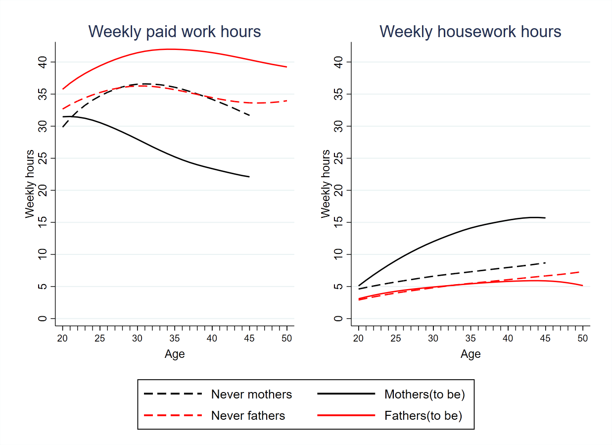
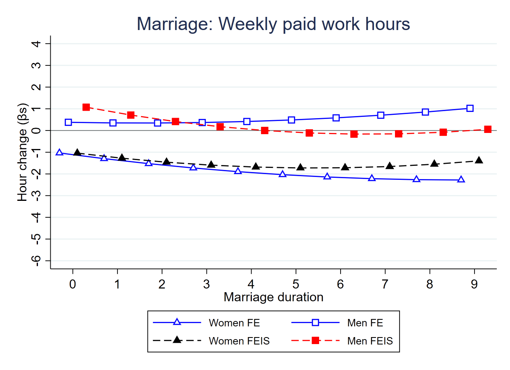
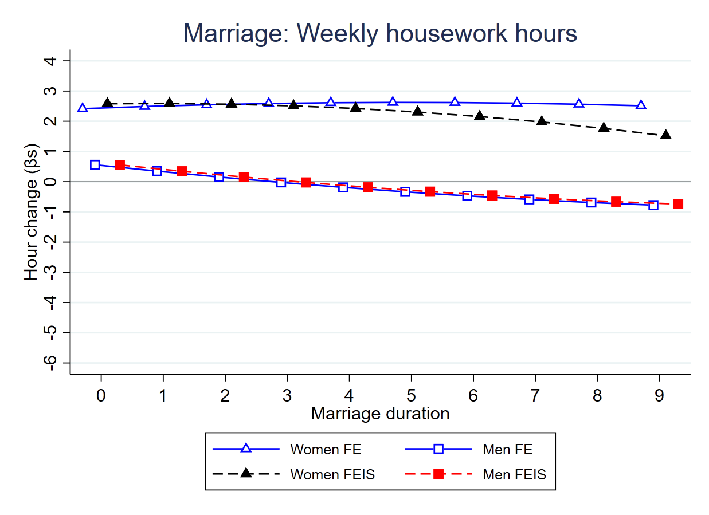
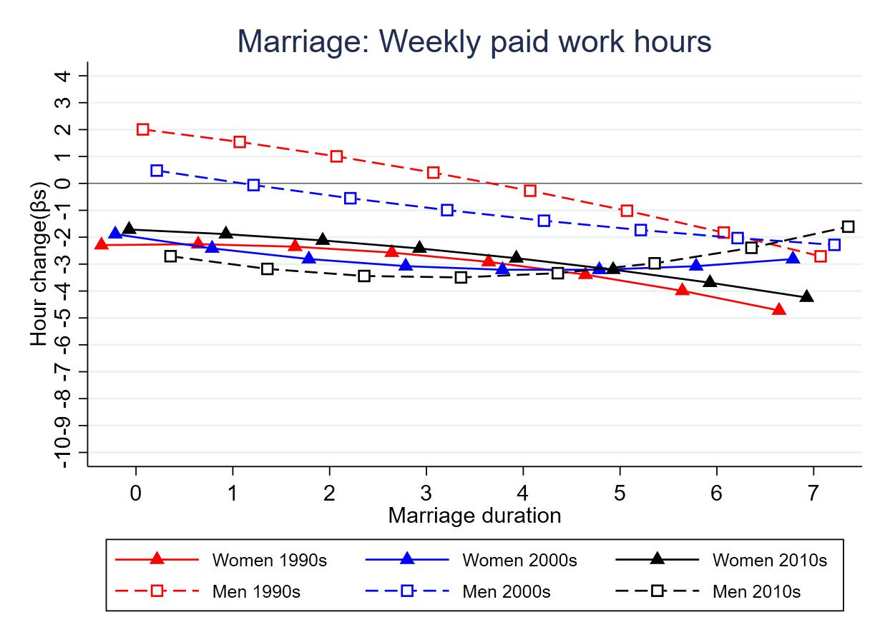
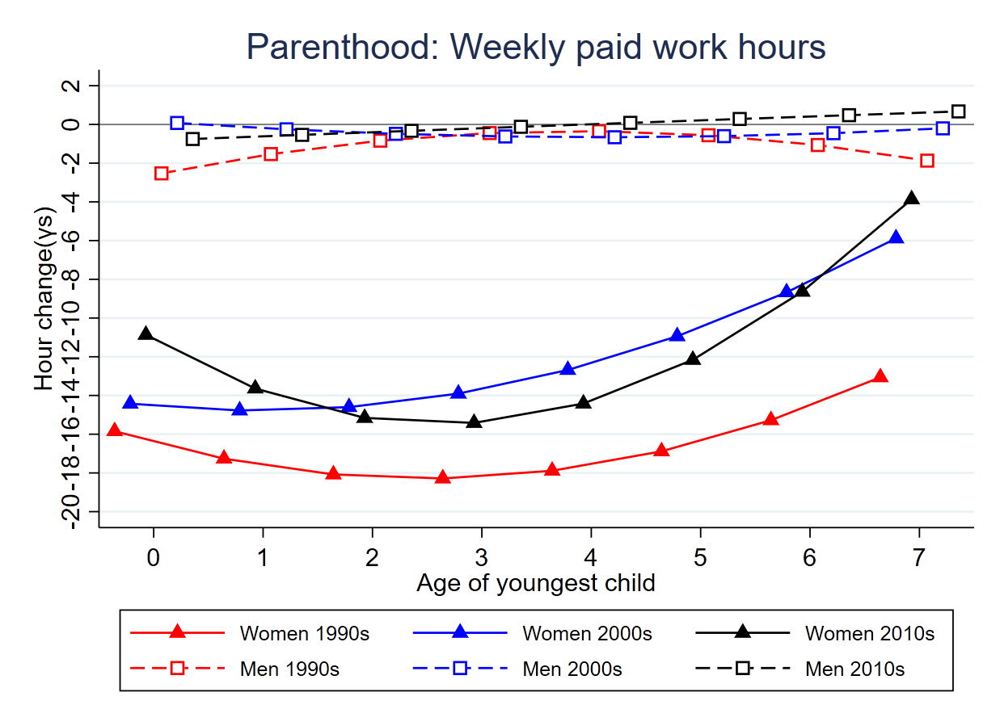

1. Research Question {.block}
=======================================================

What are the **dynamics** in paid work time and housework time for women and men during the family formation process?

Have these changes in paid work time and housework time associated with family formation **changed** in the past three decades in the UK?

2. Introduction
==========================================================

Given that women’s educational levels are similar or even higher than men’s in almost all the OECD countries (@oecd2015), the enlarged gender gap in both paid and unpaid work during the family formation process has become a major concern.  
{width=70%}

Figure 1: LOWESS plot of weekly paid work and housework hours by age and family status (source: see the Data and Sample section).

There is a lack of comprehensive evaluation of the theories and the fact that could explain the enlarged gender gap in time use during the family formation process.

3. Research Design
========================================================

Data that follow the same individual over the life course, with their time spent on paid work and housework and marital and parenthood status information. **Fixed-effect linear (FE)** regressions to predict the change in the time use associated with changes in family status.

**Static model**: Assumes a one-off change when people shift their family status:

$Hour_{it}=βMarital_{it}+γParent_{it}+λZ_{it}+ϑ_i+ε_{it}$

**Process model**: Examine changes surrounding the transitions and over the course of marriage & parenthood:

::: {.figure-example}

$Hour_{it}=β_0Marital_{it}+β_1Duration_{it}+β_2Duration_{it}^2$ 
$+γ_0 Parent_{it}+γ_1ChildAge_{it}+γ_2ChildAge_{it}^2$
$+λZ_{it}+ϑ_i+ε_{it}$

:::

FE assumes that people selected into marriage/parenthood (treatment group) experience the same time use growth paths as those who are not (control group). To relext this assumption, we also use **fixed-effect individual-slope (FEIS)** regressions. This method consideres the potential of selecting people who are subject to different time use growth trends into marriage/parenthood (@ludwig2019).

4. Data and Sample
=======================================================
18 waves of BHPS and the first nine waves of the @ukhls, lasting from 1991 to 2019. 

Selected 11,143 individuals are observed in the period from 1992 to 2017, all started from single, never married, and non-parent status. 60% of them had repeated observation are used for the analysis. 44% of these individuals experienced transitions into marriage (34%) or cohabitation (26%) and 27% become parents.

5. Change in Time Use Patterns
=========================================================

::: {.figure-example}
 
{width=45%} {width=45%}

Figure 2: Change in time use as marriage forms and develops.
:::

::: {.figure-example}
 
{width=45%} {width=45%}

Figure 3: Change in time use when having and rearing a child.
:::

6. Change in the Roles of Marriage & Family
=========================================================

::: {.figure-example}
 
{width=45%} {width=45%}

Figure 4: Period-specific change as marriage forms and develops.
:::

::: {.figure-example}
 
{width=45%} {width=45%}

Figure 5: Period-specific change when having and rearing a child.
:::

7. Conclusion
=========================================================
Marriage enhances traditional gender roles through a more gendered **housework time** allocation. The effect of marriage on paid work time is limited. 

The strong traditionalizing role of parenthood on gendered time-use patterns is driven by the **much greater move of women** than that of men. 

Over the past three decades, the traditionalizing role of marriage has **disappeared**, and that of parenthood has been **weakened**. This is consistent with what has been documented for couples (@zhou2019). 

Why do certain theories (e.g., the unitary and the identity perspectives) not apply well to men’s time allocation pattern but are suitable to explain women’s behaviours during the family formation process? We argue that instead of assigning women and men complementary roles, **viewing women’s role to be more flexible than men’s is more helpful in understanding family at a time of heightened economic uncertainty**.

8. Contact Information 
================================================================
This work was supported by the European Research Council(ERC), [grant #:771736] to Prof. Man-Yee Kan.

- Email: muzhi.zhou@sociology.ox.ac.uk
- twitter: jomuzhi
-GitHub: https://github.com/jomuzhi

9. References
===================================================
